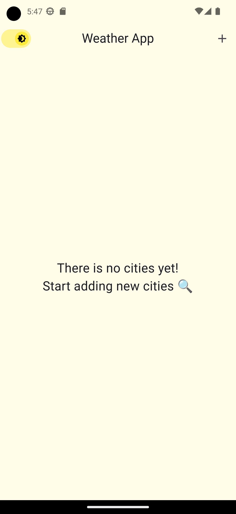
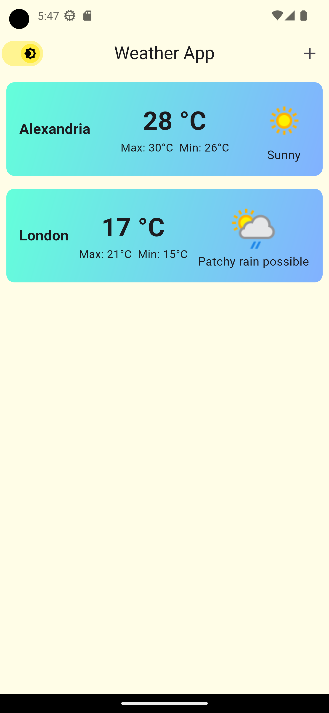
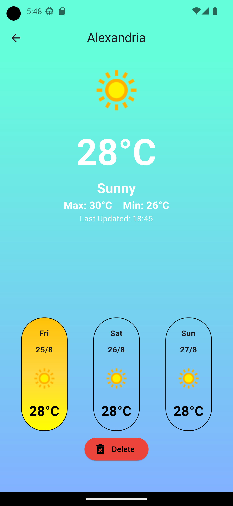

# Weather App

<p align="center"></p>

## Description

The Weather App is a simple and user-friendly mobile application built using Flutter that provides current weather information based on location. The app utilizes the "weatherapi.com" API to fetch accurate and up-to-date weather data.

## Features

- Real-time weather temperature..
- Location-based weather data retrieval for accurate local conditions.
- Intuitive and clean user interface designed for easy navigation.
- Powered by <a href="https://www.weatherapi.com/" title="Weather API">WeatherAPI.com</a>

## Screenshots

<div align="center">
  
  
  
</div>

## Installation

Follow these steps to install and run the Weather App:

1. Clone the repository:

   ```bash
   git clone https://github.com/Mohamed-code-13/weather_app_flutter.git
   ```

2. Navigate to the project directory:
   ```bash
   cd weather_app_flutter
   ```
3. Install dependencies:
   ```bash
   flutter pub get
   ```
4. Run the app:
   ```bash
   flutter run
   ```

<br>
<h1>API Key Setup</h1>
<h4>To use the "weatherapi.com" API, you'll need an API key:</h4>

1.  Sign up on weatherapi.com to obtain an API key.

2.  Replace `YOUR_API_KEY` with your actual API key in `lib/services/weather_service.dart`

<br>
<h1>License</h1>

<h4>This project is licensed under the MIT License.</h4>
